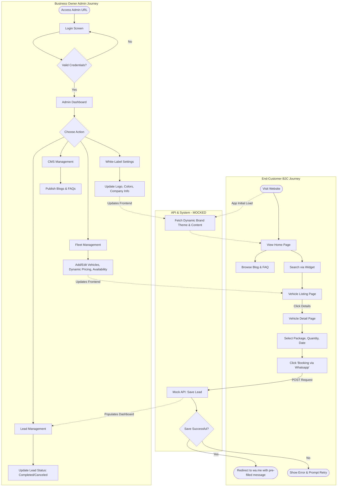

Here is the complete prompt ready to be copied and pasted to your AI coding agent (such as Cursor, Devin, GitHub Copilot, or ChatGPT).

***

# Prompt for AI Coding Agent

You are an expert frontend engineer and AI coding agent. Your objective is to build **RentFlow**, a white-label vehicle rental platform. 

### 1. App Goal Summary
Your goal is to build a high-conversion, dynamic single-page application (SPA) for local vehicle rental businesses. The platform serves two purposes: an end-customer storefront that bypasses traditional e-commerce checkout in favor of direct-to-WhatsApp booking, and an admin dashboard for business owners to manage fleet, dynamic pricing, and white-label branding. 

### 2. Tech Stack Requirements
*   **Frontend Framework:** React (with TypeScript)
*   **Styling:** Tailwind CSS (configured to accept dynamic CSS variables for white-labeling)
*   **Routing:** React Router
*   **State/Data Management:** **Stateless / Mock Data Version.** Because the backend (Laravel) is complex, you must implement a stateless version for this demo. Use robust, localized mock data files (e.g., JSON or TypeScript arrays) to simulate API calls for vehicle fetching, dynamic pricing, and global white-label settings.

### 3. Agent Instructions
Before writing any code, strictly adhere to the following rules:
*   **Plan Before Coding:** Output a step-by-step architectural plan outlining your folder structure, mock data models, and component hierarchy before generating the code.
*   **Handle Edge Cases:** Ensure graceful error handling (e.g., empty search states, missing images, invalid date selections, and missing URL variables).
*   **No Placeholder Code:** Write complete, production-ready code. Do not leave comments like `// implement logic here` or `...rest of code`. Implement the full UI, state logic, and mock data.
*   **Mock the Backend Flow:** For the "Booking via Whatsapp" flow, simulate the API delay (saving the lead) with a `setTimeout`, console log the captured payload, and then trigger the redirect to the WhatsApp deep link.

---

### 4. Product Requirements Document (PRD)

Please read and implement the following PRD:

**Project Name:** RentFlow (White-Label Vehicle Rental SaaS)
**Document Version:** 1.0
**Target Platform:** Web (Mobile-Responsive SPA)

#### 1. App Name & Purpose
*   **App Idea:** A customizable, white-label vehicle rental website designed to be sold as a single-tenant solution to rental businesses. 
*   **Tagline:** "Modernizing fleet rentals with seamless direct-to-WhatsApp booking."
*   **Problem Statement:** Local vehicle rental businesses need professional, fast, and SEO-friendly websites. However, traditional e-commerce checkout flows cause high drop-off rates in Southeast Asian markets. RentFlow solves this by providing a premium browsing experience that converts directly into WhatsApp conversations, while giving business owners complete control over their branding, dynamic pricing, and fleet management.

#### 2. User Roles & Architecture
**Architecture Note:** This is a **Single-Tenant** application. Each buyer gets their own deployment, database, and admin panel.

| Role | Description | Authentication |
| :--- | :--- | :--- |
| **End-Customer (B2C)** | Browses vehicles, reads content, selects rental parameters, and initiates booking via WhatsApp. | **No login required.** Maximizes conversion rates. |
| **Admin (Business Owner)** | Full access to the backend dashboard to manage the fleet, pricing, blog, settings (white-label branding), and view leads. | **Required.** (Mock a simple login for the demo). |

#### 3. Features & Flow

**3.1 End-Customer Frontend**
*   **Dynamic Global UI:**
    *   Header: Displays Logo, Hotline, WhatsApp number, and physical address (data fetched from mock API).
    *   Dynamic Theming: Primary and secondary colors are fetched via mock API on load and injected as CSS variables to override Tailwind defaults dynamically.
    *   Floating WhatsApp Widget globally available in the bottom right corner.
*   **Home Page:**
    *   **Hero Section:** High-quality background image/slider.
    *   **Search Widget:** Dropdowns for *Brand*, *Transmission*, and *Year*, routing to the listing page.
    *   **FAQ Section:** Accordion style list of frequently asked questions.
*   **Vehicle Listing Page:**
    *   Grid view of vehicle cards.
    *   Each card displays: Image, Vehicle Name, Category (SUV, MPV), Specs icons (Transmission, Year, Fuel, Seats), and "Start from" price.
    *   Quick "WhatsApp" icon button and "Lihat Detail" (View Detail) button.
*   **Vehicle Detail Page (Core Conversion Page):**
    *   **Header:** Main vehicle image/gallery, Title, Spec icons.
    *   **Dynamic Pricing Widget:** Radio buttons listing custom rental packages (e.g., "Car + Driver / 12 Hours", "Lepas Kunci (Fullday)").
    *   **Rental Inputs:** Quantity selector (`- 1 +`) and Rental Date picker.
    *   **Dynamic Content Tabs:** 
        *   *Deskripsi* (Rich text description and bullet points).
        *   *Fasilitas* (Features/Amenities).
        *   *Syarat & Ketentuan* (Terms & Conditions).
        *   *Area Layanan* (Service Areas).
*   **Blog & Static Pages:**
    *   Blog listing and detail pages for SEO purposes.
    *   Static pages for "Tentang Kami" (About Us), "Kontak" (Contact), and "Testimonial".

**3.2 Booking Flow (Crucial Logic)**
1.  User selects a pricing package, quantity, and date on the Vehicle Detail page.
2.  User clicks **"Booking via Whatsapp"**.
3.  **Backend Action:** Simulate a POST request. Save this as a "Pending Lead" (capturing Vehicle, Package, Date).
4.  **Frontend Action:** Upon successful mock API response, redirect the user to the `wa.me` deep link.
5.  **WhatsApp Payload:** The message is pre-filled: *"Halo, saya ingin menyewa [Nama Mobil] dengan paket [Nama Paket] untuk tanggal [Tanggal]. Apakah tersedia?"*

**3.3 Admin Backend (Mock Panel)**
*   **Dashboard:** Overview of total vehicles, total saved leads, and blog posts.
*   **White-Label Settings Manager:**
    *   Mock UI for uploading Logo/Favicon.
    *   Color Pickers for Primary, Secondary, and Accent colors.
    *   Company Info inputs.
*   **Fleet Management:**
    *   CRUD UI for Vehicles.
    *   **Availability Toggle:** Manually mark a car as "Available" or "Out of Service". 
    *   **Dynamic Pricing Engine:** Repeater field to add unlimited pricing rows.

---

### 5. Architecture Flowchart

Please trace and implement your logic according to this flowchart:

